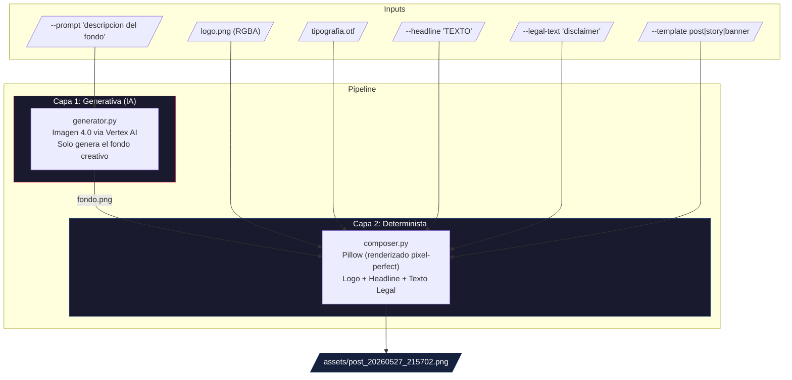
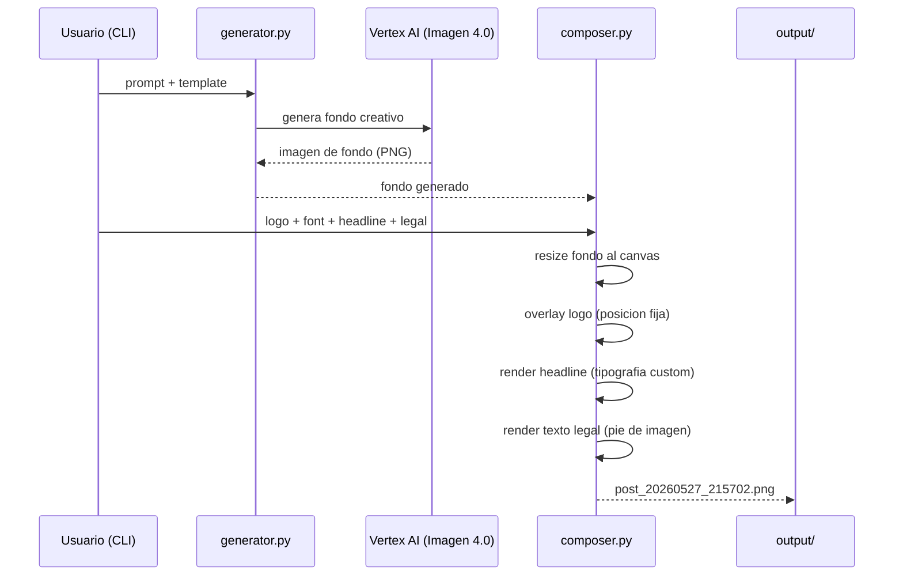
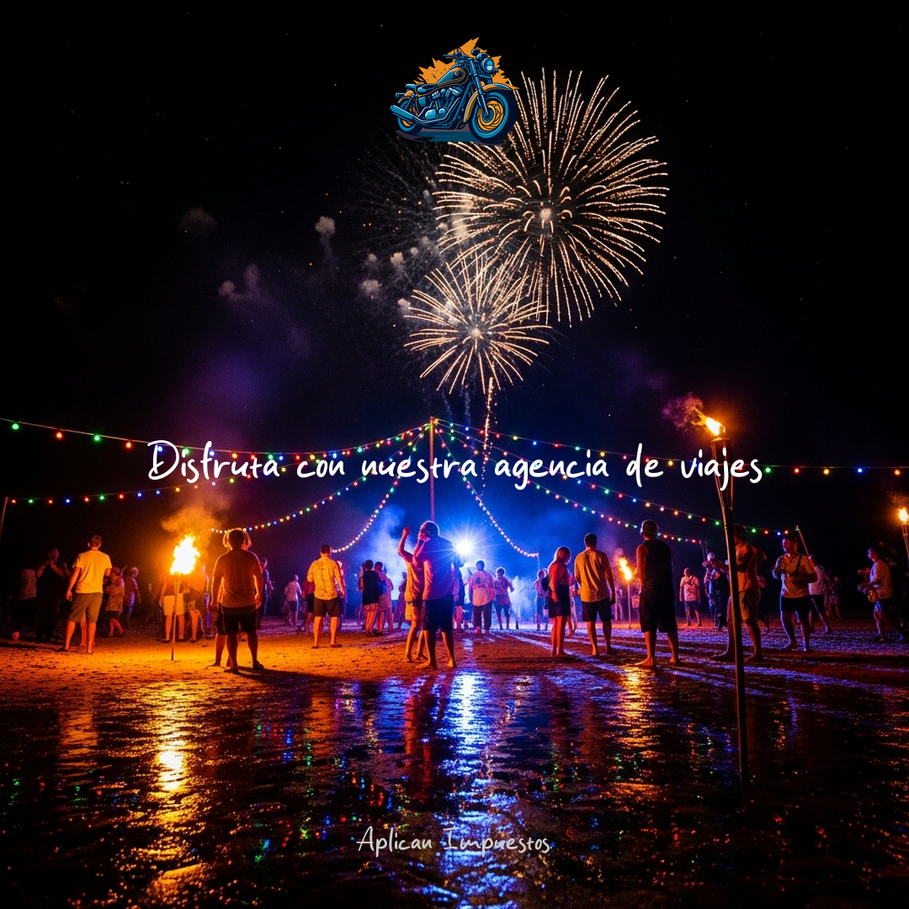
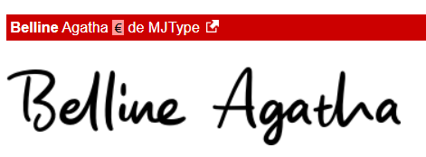

# Creative Pipeline: Zero-Hallucination Brand Assets

Pipeline hibrido que genera creativos publicitarios con **100% de fidelidad** en logos, tipografia y textos legales, usando IA generativa solo para el fondo.

---

## Enunciado del reto

> Los modelos de difusion consistentemente tienen problemas para renderizar texto y logos con fidelidad, tanto en modelos open-source como closed-source de ultima generacion, incluso cuando se les dan instrucciones explicitas. Esto es un bloqueador critico para creativos publicitarios generados por IA, donde las marcas requieren reproduccion pixel-perfect de logos, tipografias especificas y disclosures legales ("letras chiquitas") en posiciones y tamanos fijos.
>
> Dada esta limitacion, proponga un pipeline que garantice un 100% de fidelidad para estos elementos fijos de marca, mientras sigue aprovechando IA generativa para el fondo creativo y la composicion.

---

## Arquitectura Propuesta

La solucion separa el pipeline en **dos capas independientes**: una capa generativa (IA) que solo produce el fondo, y una capa determinista que renderiza con precision pixel-perfect todos los brand assets.



### Principio clave

| Capa             | Responsabilidad               | Tecnologia             | Fidelidad                     |
| ---------------- | ----------------------------- | ---------------------- | ----------------------------- |
| **Generativa**   | Fondo creativo                | Imagen 4.0 (Vertex AI) | No requiere fidelidad textual |
| **Determinista** | Logo, tipografia, texto legal | Pillow (Python)        | 100% pixel-perfect            |

La IA **nunca toca** los brand assets. Solo genera backgrounds donde no importa la precision textual.

---

## Flujo del Pipeline



---

## Resultado



---

## Tipografia utilizada

La fuente elegida para headlines y texto legal es **Belline Agatha** de MJType:



Archivo: `assets/tipografia.otf`

## Assets de marca

Los assets se encuentran en la carpeta `assets/`:

| Archivo              | Descripcion                                             |
| -------------------- | ------------------------------------------------------- |
| `logo.png`           | Logo principal de la marca (PNG con transparencia RGBA) |
| `tipografia.otf`     | Fuente Belline Agatha Regular                           |
| `fuente_elegida.png` | Preview visual de la tipografia                         |

Para usar tus propios assets, reemplaza estos archivos o usa los flags `--logo` y `--font` en el CLI.

## Requisitos previos

- **Python 3.13+**
- **uv** (gestor de paquetes) - [Instalar uv](https://docs.astral.sh/uv/getting-started/installation/)
- **Google Cloud SDK (gcloud)** - [Instalar gcloud](https://cloud.google.com/sdk/docs/install)
- Una cuenta de Google Cloud con facturacion habilitada

## Instalacion paso a paso

### 1. Clonar e ingresar al proyecto

```bash
cd level-2-creative-pipeline
```

### 2. Instalar dependencias

```bash
uv sync
```

Esto crea el entorno virtual (`.venv/`) e instala todas las dependencias automaticamente.

### 3. Configurar Google Cloud (Vertex AI)

#### 3.1 Autenticarse

```bash
gcloud auth application-default login
```

Se abrira el navegador para que inicies sesion con tu cuenta de Google.

#### 3.2 Habilitar la API de Vertex AI

```bash
gcloud services enable aiplatform.googleapis.com --project=TU_PROJECT_ID
```

### 4. Configurar variables de entorno

Crea un archivo `.env` en la raiz del proyecto:

```bash
cp .env.example .env
```

Edita `.env` con tus valores:

```env
GCP_PROJECT_ID=tu-project-id-aqui
GCP_LOCATION=us-central1
```

> **Nota:** El archivo `.env` esta en `.gitignore` y nunca se sube al repositorio.

### 5. Verificar instalacion

```bash
uv run pytest tests/ -v
```

Si los 9 tests pasan, la instalacion es correcta.

## Uso

### Generar un creativo con IA

```bash
uv run python src/cli.py \
  --prompt "tropical beach sunset, golden hour" \
  --template post \
  --headline "SUMMER SALE 50% OFF" \
  --legal-text "Terminos y condiciones aplican."
```

### Opciones del CLI

| Flag           | Requerido | Descripcion                                        |
| -------------- | --------- | -------------------------------------------------- |
| `--prompt`     | Si\*      | Prompt para generar el fondo con IA                |
| `--background` | Si\*      | Ruta a imagen local (alternativa a --prompt)       |
| `--template`   | No        | Formato: `post`, `story`, `banner` (default: post) |
| `--headline`   | No        | Texto principal del creativo                       |
| `--legal-text` | No        | Texto legal / disclaimers                          |
| `--logo`       | No        | Ruta al logo (default: assets/logo.png)            |
| `--font`       | No        | Ruta a la fuente (default: assets/tipografia.otf)  |
| `--output`     | No        | Ruta de salida (auto-generada si no se pasa)       |

> \*Se requiere `--prompt` O `--background`, al menos uno.

### Formatos disponibles

| Template | Resolucion | Uso tipico               |
| -------- | ---------- | ------------------------ |
| `post`   | 1080x1080  | Instagram/Facebook feed  |
| `story`  | 1080x1920  | Instagram/TikTok Stories |
| `banner` | 1200x628   | Facebook/LinkedIn ads    |

### Ejemplos

```bash
# Post para Instagram con fondo generado por IA
uv run python src/cli.py \
  --prompt "coffee shop interior, warm lighting, cozy" \
  --template post \
  --headline "NEW MENU" \
  --legal-text "Solo en tiendas participantes."

# Story usando una imagen local como fondo
uv run python src/cli.py \
  --background mi_foto.jpg \
  --template story \
  --headline "FLASH SALE" \
  --legal-text "Oferta valida por 24 horas."

# Banner sin texto legal
uv run python src/cli.py \
  --prompt "abstract gradient, purple and blue" \
  --template banner \
  --headline "COMING SOON"
```

### Donde se guardan las imagenes

Las imagenes generadas se guardan en `output/` con el nombre `{template}_{timestamp}.png`.

## Estructura del proyecto

```
level-2-creative-pipeline/
├── src/
│   ├── cli.py              # Entry point - orquesta el pipeline
│   ├── generator.py        # Capa 1: genera fondos con Imagen 4.0 (Vertex AI)
│   ├── composer.py         # Capa 2: composicion determinista con Pillow
│   └── templates.py        # Carga y parsea plantillas JSON
├── templates/
│   ├── story.json          # Layout para Stories (1080x1920)
│   ├── post.json           # Layout para Posts (1080x1080)
│   └── banner.json         # Layout para Banners (1200x628)
├── assets/
│   ├── logo.png            # Logo de marca (PNG con transparencia)
│   ├── tipografia.otf      # Fuente Belline Agatha
│   └── fuente_elegida.png  # Preview de la tipografia
├── tests/
│   └── test_composer.py    # Tests del compositor (9 tests)
├── output/                 # Imagenes generadas (gitignored)
├── .env                    # Variables de entorno (gitignored)
├── .env.example            # Plantilla de variables
├── .gitignore
└── pyproject.toml          # Configuracion del proyecto y dependencias
```

## Tests

```bash
uv run pytest tests/ -v
```

Los tests validan:

- Dimensiones correctas de salida para los 3 formatos
- Logo renderizado en la posicion esperada
- Headline renderizado en la zona central
- Texto legal renderizado en la zona inferior
- Text wrapping para textos largos
- Que el background original no se modifica

## Notas

- La generacion de fondos usa **Imagen 4.0** de Google via Vertex AI (postpago)
- El prompt se enriquece automaticamente con modificadores fotograficos para evitar el "look de IA"
- Las posiciones de los elementos se definen como porcentajes del canvas en los JSON de templates, haciendo facil agregar nuevos formatos
