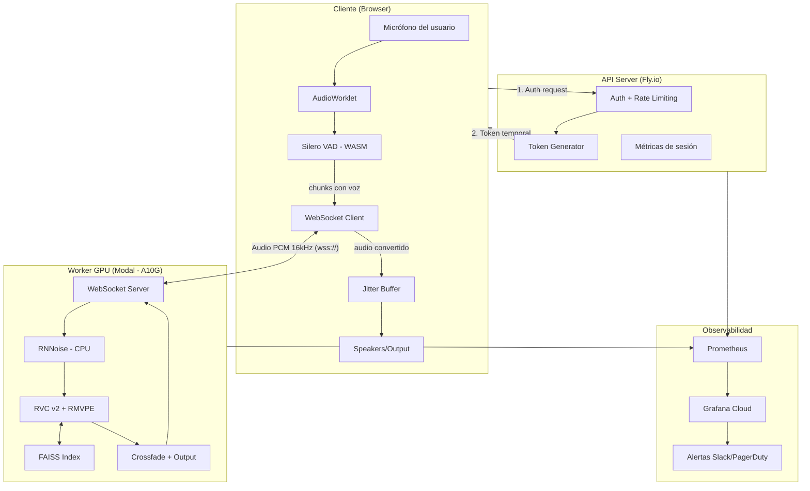
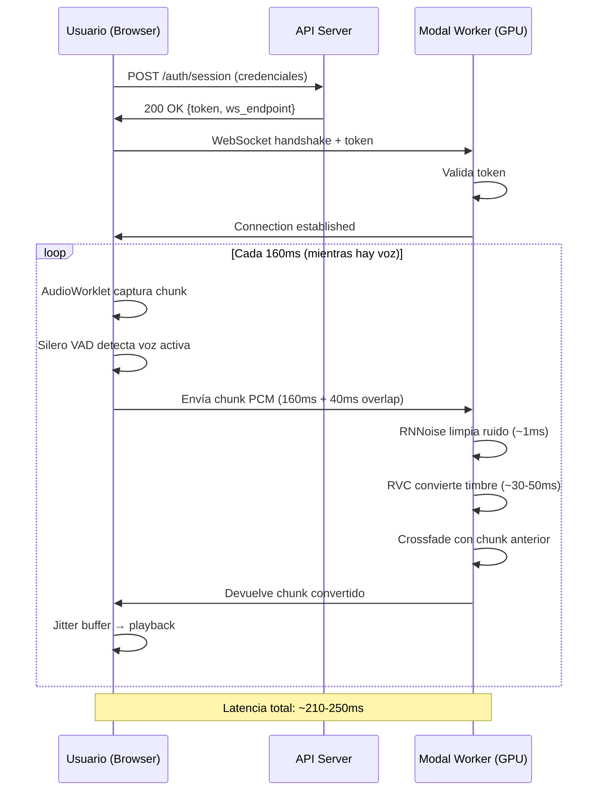
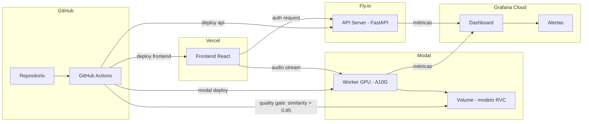

# Sistema de Conversión de Voz en Tiempo Real — Arquitectura MVP

## El problema

Necesitamos que un usuario hable por micrófono y que su voz salga transformada, sonando como un avatar de marca previamente registrado. No estamos hablando de cambiar lo que dice — el contenido, el ritmo, las pausas, la intención emocional deben permanecer intactos. Solo cambia el timbre: quién parece estar hablando.

Pensemos en el escenario concreto: una empresa tiene un personaje de marca (como un asistente virtual con identidad propia) y quiere que un operador humano pueda "prestarse" como la voz de ese personaje en tiempo real. El operador habla con su cadencia natural, hace pausas cuando piensa, enfatiza palabras cuando quiere — y todo eso se preserva, pero el oyente percibe la voz del avatar.

El sistema debe funcionar con latencia imperceptible para una conversación fluida, ser robusto en condiciones reales de audio (no solo en un estudio silencioso), y estar listo para producción — no un notebook de Jupyter que funciona en una demo.

---

## Decisión fundamental: ¿Cómo se transforma la voz?

Hay dos caminos radicalmente distintos para resolver esto, y la elección entre ellos condiciona toda la arquitectura.

### Camino A: Voice Conversion directa

El audio entra como señal, se transforma el timbre en el dominio acústico, y sale como señal. Es como ponerle un "filtro de voz" sofisticado — la señal nunca deja de ser audio, nunca se convierte a texto.

### Camino B: Transcripción + Síntesis (STT → TTS)

El audio se transcribe a texto, y luego un sistema text-to-speech genera el audio con la voz objetivo. El texto actúa como intermediario.

### Por qué elegimos el Camino A

El requisito de preservar expresividad no es negociable. Cuando alguien dice "no, no creo que eso funcione" con un tono escéptico sutil, ese escepticismo vive en las micro-variaciones de pitch, en la elongación de vocales, en los silencios entre palabras. Un pipeline STT→TTS destruye todo eso: Whisper transcribe "no, no creo que eso funcione" y luego ElevenLabs genera una lectura genérica de esa frase. El resultado suena correcto pero emocionalmente muerto.

Además, el camino STT→TTS acumula latencia de tres etapas independientes. Whisper streaming necesita ~300ms de buffer mínimo para producir texto coherente, luego el TTS necesita otros ~200ms para sintetizar audio. Solo en procesamiento ya estás en ~500ms sin contar red — fuera de nuestro presupuesto.

La conversión directa es más exigente técnicamente, pero es la única que honra el requisito real del producto.

---

## El modelo elegido: RVC (Retrieval-based Voice Conversion)

### Qué es y por qué

RVC es un framework de voice conversion que combina un encoder de contenido (basado en HuBERT) con un generador neuronal y un mecanismo de retrieval que busca las features más cercanas en un índice de la voz objetivo. En términos simples: entiende _qué_ se está diciendo (contenido fonético), busca cómo la voz objetivo diría esos sonidos, y genera audio con ese timbre.

### Alternativas evaluadas

| Modelo                  | Ventaja principal                                | Por qué no lo elegimos                                                                                                                                                          |
| ----------------------- | ------------------------------------------------ | ------------------------------------------------------------------------------------------------------------------------------------------------------------------------------- |
| **OpenVoice v2**        | Zero-shot — clona con 30s de audio, sin entrenar | Latencia de 400-600ms por chunk en vanilla. La calidad en español es inconsistente. Para un avatar de marca fijo, no necesitamos zero-shot — podemos invertir en entrenar bien. |
| **So-VITS-SVC 4.0**     | Calidad excelente en voz cantada y expresiva     | Computacionalmente pesado, difícil de llevar debajo de 300ms en streaming. La comunidad está fragmentada y el mantenimiento es incierto — riesgo para producción.               |
| **Seed-VC (ByteDance)** | Arquitectura moderna, diseñada para streaming    | Paper reciente (2024), pocas implementaciones de referencia en producción. Documentación escasa. No queremos ser early adopters en un MVP que debe ser estable.                 |
| **kNN-VC**              | Simple, robusto, fácil de entender               | Calidad notablemente inferior. El resultado suena "procesado" — aceptable para investigación, no para un producto que representa una marca.                                     |

### Por qué RVC gana

1. **Comunidad madura y activa**: implementaciones probadas en producción real (w-okada voice changer, rvc-realtime), miles de modelos entrenados por la comunidad, bugs documentados y resueltos.

2. **Latencia demostrada**: las implementaciones real-time existentes reportan <200ms de latencia algorítmica en GPU. No es una promesa teórica — hay software funcionando.

3. **Licencia MIT**: control total del deployment, sin dependencias de terceros ni riesgo de cambios de pricing.

4. **Calidad-costo óptima**: con 20-30 minutos de audio limpio y un entrenamiento de ~30 minutos en GPU, produces un modelo que captura bien el timbre. Para un avatar de marca fijo (no necesitas cambiar de voz cada día), este costo de setup es trivial.

5. **Control fino**: el índice FAISS permite balancear calidad vs. latencia ajustando el index ratio. Podemos ser conservadores para producción (ratio 0.4) y subir para demos donde la latencia importa menos.

El trade-off principal: RVC no fue diseñado originalmente para streaming. Las implementaciones real-time son "hacks" sobre la arquitectura base. Pero son hacks probados por miles de usuarios, no prototipos frágiles.

---

## Arquitectura del sistema

---

## Desglose del pipeline de audio

### En el cliente

El navegador captura audio a 16kHz mono mediante la Web Audio API. Un AudioWorklet (que corre en un thread separado para no bloquear la UI) acumula samples hasta completar un chunk de 160ms (2560 samples). Antes de enviar, Silero VAD — compilado a WebAssembly y corriendo localmente — determina si hay voz activa. Si es silencio, no se envía nada. Esto no es solo una optimización de bandwidth: evita que el modelo RVC procese silencio y genere artefactos (ruido fantasma, respiraciones amplificadas).

El chunk se envía como PCM 16-bit raw sobre WebSocket con TLS. No usamos Opus en el MVP — la compresión ahorraría bandwidth pero agrega complejidad de encode/decode y potencialmente degrada la señal que entra a RVC. Para un MVP con pocos usuarios concurrentes, el bandwidth extra (~256 kbps por sesión) es despreciable.

### En el servidor (Modal)

El worker recibe el chunk y lo pasa por RNNoise, un modelo de supresión de ruido que corre en CPU en ~1ms. Esto limpia lo que el micrófono del usuario no pudo evitar: el ventilador de la laptop, la calle, el teclado. RNNoise no es perfecto, pero es lo suficientemente bueno para que RVC reciba una señal donde la voz domina claramente sobre el fondo.

Luego, RVC procesa el chunk:

1. Extrae pitch con RMVPE (más robusto que CREPE en condiciones reales).
2. Extrae features de contenido con HuBERT.
3. Consulta el índice FAISS para encontrar las features más cercanas de la voz objetivo (ratio 0.4 — conservador para latencia).
4. Genera audio con el timbre objetivo preservando pitch y timing originales.

Finalmente, se aplica crossfade (40ms de overlap con el chunk anterior) para eliminar clicks y discontinuidades en los bordes de chunk. El resultado se envía de vuelta por el WebSocket.

### Reproducción

El cliente mantiene un jitter buffer de 2 chunks (~320ms). Esto absorbe variaciones de latencia de red: si un chunk llega 50ms tarde, el buffer lo cubre sin que el oyente note un corte. Si un chunk llega más de 350ms tarde, se dropea — un gap de 160ms es menos disruptivo que audio que se va acumulando desfasado.

---

## Infraestructura y por qué Modal

### El problema de GPU para inferencia real-time

RVC necesita GPU para inferencia en tiempo real. Las opciones clásicas son:

- **GPU dedicada en cloud (EC2 g5.xlarge)**: pagas ~$1/hora 24/7 independientemente de si hay usuarios. Para un MVP con uso esporádico, eso es quemar dinero.
- **Serverless sin GPU**: imposible. RVC en CPU tarda ~2s por chunk — inaceptable.
- **Edge/on-device**: requiere que el usuario tenga GPU. Descarta móvil y la mayoría de laptops.

### Por qué Modal

Modal resuelve el dilema con `keep_warm`: mantienes un container con GPU caliente (sin cold start) pero solo durante las horas que defines. El modelo:

- **Horario pico (12 horas)**: 1 worker A10G warm, listo para responder en <50ms. Costo: ~$0.65/hora.
- **Fuera de horario**: scale-to-zero. Si alguien conecta, espera ~10-15s de cold start (con un "Preparando sistema..." en la UI).
- **Picos de concurrencia**: Modal auto-escala workers adicionales.

Costo estimado: **~$500-600/mes** para un MVP con uso moderado. Comparado con ~$950/mes de una GPU 24/7, es un ahorro significativo con la misma experiencia en horario activo.

Además, el deployment es un solo comando (`modal deploy`) desde CI. No hay Kubernetes, no hay Docker registries, no hay load balancers que configurar. Para un equipo pequeño o un solo developer, esto es la diferencia entre lanzar en 2 semanas y lanzar en 2 meses.

---

## Registro de la voz objetivo

El modelo RVC se entrena offline con audio de la voz del avatar de marca. El proceso:

1. **Grabación**: 20-30 minutos de audio en estudio (48kHz, sin reverberación, micrófono condensador). Necesitamos variedad: distintos tonos, velocidades, emociones. No queremos 20 minutos leyendo un script en monotono — el modelo necesita ver el rango expresivo de la voz.

2. **Preprocesamiento**: segmentar en utterances de 5-15s, eliminar silencios largos, normalizar volumen.

3. **Entrenamiento**: RVC v2 con RMVPE para pitch extraction. ~30-40 minutos en una A10G. Genera un modelo (.pth) y un índice FAISS (.index).

4. **Validación automática**: corremos un corpus de 30 utterances de prueba (distintas voces de entrada) y medimos:
   - Speaker similarity > 0.85 (resemblyzer embeddings)
   - Word Error Rate del audio convertido vs. original < 5% de degradación (verificamos que el contenido sigue siendo inteligible)

5. **Deploy**: el modelo validado se sube a un Modal Volume y el worker lo carga al iniciar.

Este proceso se hace una vez. Si la marca quiere actualizar su voz (nuevo actor, ajuste de tono), se repite el pipeline — automatizable como un job de CI.

---

## Desafíos principales y cómo los enfrentamos

### 1. Latencia — el enemigo constante

**El desafío**: 200-300ms de presupuesto total, repartidos entre buffering de audio (160ms), inferencia (30-50ms), y red (20-40ms). No hay margen para ineficiencias.

**Ejemplo concreto**: si el usuario dice "Hola, ¿cómo estás?" y la primera sílaba tarda 500ms en salir, el oyente percibe un sistema roto — no un avatar hablando naturalmente.

**Mitigación**: chunks de 160ms (el mínimo que RVC puede procesar con calidad aceptable), FAISS index ratio conservador (0.4 vs. 0.75 default), y dropeo agresivo de chunks tardíos. Preferimos un micro-gap inaudible a audio que se acumula desfasado.

### 2. Calidad de audio del mundo real

**El desafío**: en demo, el audio es perfecto — micrófono de estudio, sala silenciosa. En producción, el usuario está en un café con el micrófono de sus AirPods baratos. El ruido de fondo, la reverberación, y la baja calidad del micrófono degradan la conversión.

**Ejemplo concreto**: un operador de call center en una oficina abierta. Voces de compañeros, el aire acondicionado, teclados mecánicos. Si todo eso entra a RVC, el modelo intenta "convertir" también el ruido de fondo, produciendo artefactos grotescos.

**Mitigación**: pipeline de limpieza en dos etapas (Silero VAD para no enviar silencio + RNNoise para eliminar ruido antes de que toque RVC). Si después de limpiar el SNR sigue debajo de -20dB, no procesamos — mejor silencio que basura audible.

### 3. Robustez en producción

**El desafío**: un worker GPU puede crashear, la red puede tener un spike, el usuario puede desconectarse momentáneamente. En un demo esto es un "reinicia y prueba de nuevo". En producción es inaceptable.

**Ejemplo concreto**: a mitad de una frase del avatar, el worker Modal se reinicia por un error de memoria. El oyente escucha la mitad de "Le confirmo que su reserva está—" y luego silencio.

**Mitigación**:

- `keep_warm=1` minimiza cold starts.
- Reconexión automática del WebSocket con backoff exponencial (1s, 2s, 4s).
- Buffer circular de ~2s en el cliente para cubrir desconexiones breves.
- Máximo 3 reintentos antes de mostrar error al usuario — no queremos loops infinitos.

### 4. Preservar identidad de voz con voces de entrada diversas

**El desafío**: el modelo fue entrenado para sonar como "Avatar X". Pero los operadores que lo usan tienen voces muy distintas — masculina grave, femenina aguda, hablante rápido, hablante lento, con acento regional. La conversión debe producir resultados consistentes independientemente de quién entre.

**Ejemplo concreto**: un operador con voz grave masculina y otro con voz aguda femenina dicen la misma frase. Ambas salidas deben sonar convincentemente como el mismo avatar, sin que una suene más natural que la otra.

**Mitigación**: el entrenamiento del modelo RVC se valida explícitamente con un corpus que incluye voces de entrada diversas. Si la similarity score cae significativamente para algún tipo de voz, se investiga antes de ir a producción. RVC es razonablemente robusto aquí porque separa contenido de timbre a nivel de embeddings, pero es algo que se monitorea.

### 5. El "uncanny valley" vocal

**El desafío**: si la conversión es buena al 95%, ese 5% restante puede sonar más perturbador que una voz claramente sintética. Los humanos somos extremadamente sensibles a voces que "casi" suenan naturales.

**Ejemplo concreto**: la voz convertida tiene un vibrato inconsistente en vocales largas, o las consonantes fricativas (s, f, z) suenan metálicas. El oyente no puede identificar _qué_ está mal, pero sabe que algo no es natural.

**Mitigación**: el gate de calidad pre-producción con speaker similarity > 0.85 y validación de inteligibilidad. Si no lo pasamos, no lanzamos — iteramos en el entrenamiento (más datos, mejor calidad de grabación). En producción, el monitoreo de speaker similarity por muestreo detecta si la calidad se degrada con el tiempo.

---

## Seguridad y privacidad

La voz es dato biométrico. Nuestra postura para el MVP:

- **Procesamiento efímero**: el audio existe en RAM durante la conversión (~50ms) y se descarta inmediatamente. No se almacena en disco, no se envía a terceros, no se usa para mejorar modelos.
- **Transporte cifrado**: WebSocket sobre TLS (wss://). No negociable.
- **Consentimiento explícito**: antes de activar el micrófono, el usuario acepta qué se hace con su audio (procesamiento real-time, sin almacenamiento).
- **Logs sin audio**: solo metadata de sesión (duración, latencia promedio, errores). Nunca audio.
- **Derechos sobre la voz objetivo**: contrato con el voice talent que autorice el uso de su voz para síntesis.

---

## Costos estimados

| Componente       | Servicio                   | Costo mensual     |
| ---------------- | -------------------------- | ----------------- |
| Inferencia GPU   | Modal (A10G, 12h warm/día) | ~$470             |
| API server       | Fly.io                     | ~$10              |
| Frontend hosting | Vercel                     | ~$0 (free tier)   |
| Observabilidad   | Grafana Cloud (free tier)  | ~$0               |
| Dominio + DNS    | Cloudflare                 | ~$15              |
| **Total**        |                            | **~$500-600/mes** |

Costo por sesión de usuario (5 minutos promedio): **~$0.11**

El modelo es financieramente viable si:

- Se absorbe como presupuesto de marketing/branding (un avatar de marca que habla en vivo vale más que $0.11 por interacción), o
- Se cobra por uso a empresas que integran el sistema.

---

## Stack tecnológico completo

| Capa              | Tecnología                   | Justificación                                      |
| ----------------- | ---------------------------- | -------------------------------------------------- |
| Captura de audio  | Web Audio API + AudioWorklet | Thread separado, no bloquea UI                     |
| VAD (cliente)     | Silero VAD (ONNX/WASM)       | Ligero (~2MB), preciso, evita enviar silencio      |
| Transporte        | WebSocket (wss://)           | Bidireccional, simple, soportado universalmente    |
| Auth/sesión       | FastAPI en Fly.io            | Ligero, barato, token temporal para acceso directo |
| Noise suppression | RNNoise                      | CPU-only, ~1ms, elimina ruido sin distorsionar     |
| Voice conversion  | RVC v2 + RMVPE + FAISS       | Calidad probada, latencia <50ms, MIT license       |
| Inferencia GPU    | Modal (A10G)                 | Pay-per-use, warm containers, deploy trivial       |
| Frontend          | React + Vercel               | Deploy automático, CDN global                      |
| Observabilidad    | Prometheus + Grafana Cloud   | Métricas por etapa, alertas, free tier             |
| CI/CD             | GitHub Actions               | Gate de calidad automatizado pre-deploy            |

---

## Diagrama de deployment

