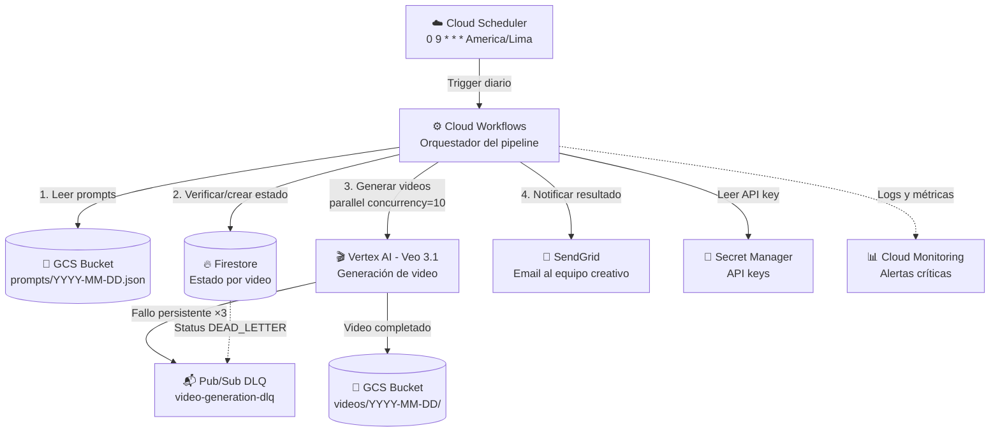
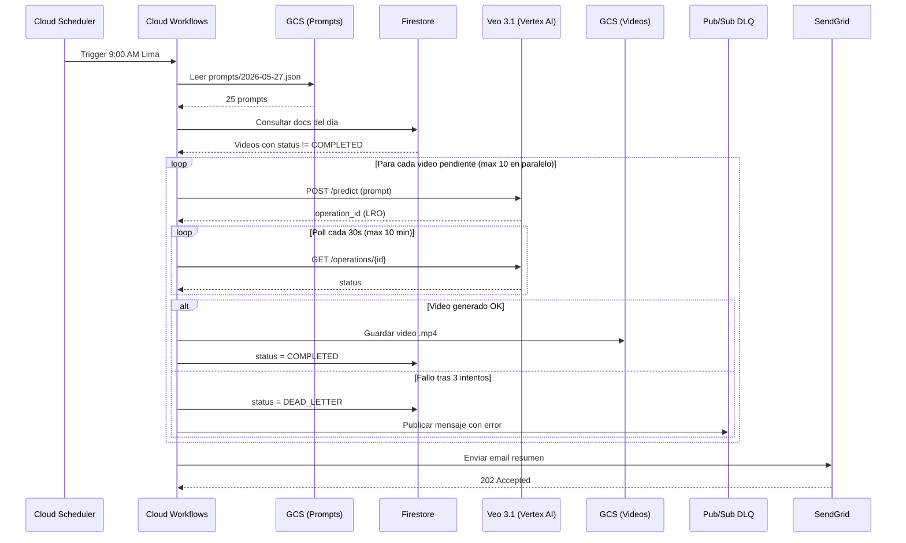

# Pipeline Batch de Generación de Videos con Veo 3.1 en GCP

## Problema

Diseñar una arquitectura en GCP para un pipeline batch programado que genera 25 videos diarios a las 9:00 AM (hora Lima, Perú) usando la API de Veo 3.1 en Vertex AI.

**Restricciones:**

- Idempotente: se puede reiniciar sin duplicar videos ya completados.
- Máximo 10 solicitudes concurrentes a la API.
- Dead-letter queue para fallos que agotan reintentos.
- Notificación por email al equipo creativo al finalizar.

---

## Arquitectura General



---

## Flujo paso a paso



---

## Servicios GCP utilizados

### 1. Cloud Scheduler

**Qué hace:** Dispara el pipeline todos los días a las 9:00 AM hora Lima.

**Por qué este servicio:** Es el cron nativo de GCP. Soporta timezone `America/Lima` directamente, así que no hay que hacer conversiones manuales a UTC. Lima no tiene cambio de horario de verano, entonces `0 9 * * *` siempre significa las 9 de la mañana sin sorpresas. Si el trigger falla, tiene su propio mecanismo de reintento.

**Costo estimado:** ~$0.10/mes por un solo job.

---

### 2. Cloud Workflows

**Qué hace:** Es el cerebro del pipeline. Lee los prompts, coordina las llamadas a Veo 3.1, maneja reintentos, y decide cuándo notificar.

**Por qué este servicio:** Para 25 videos al día, necesitamos algo que coordine tareas con control de concurrencia, reintentos, y pasos condicionales. Cloud Workflows resuelve todo esto de forma declarativa:

- `parallel for` con `concurrency_limit: 10` garantiza que nunca mandemos más de 10 solicitudes simultáneas.
- `retry` con backoff exponencial está integrado en cada step.
- Es serverless: no hay un servidor corriendo 24/7 esperando que sean las 9 AM.

La alternativa sería Cloud Composer (Airflow), pero para un pipeline de 25 items una vez al día sería como alquilar un camión para llevar una mochila. Workflows cuesta centavos y no requiere mantener infraestructura.

---

### 3. Vertex AI (Veo 3.1)

**Qué hace:** Genera los videos a partir de prompts de texto.

**Por qué este servicio:** Es la única forma de acceder a Veo 3.1 en GCP. La API es asíncrona (devuelve un ID de operación y hay que consultar periódicamente hasta que termine). Esto es importante porque cada video tarda entre 2-5 minutos en generarse.

**Supuestos:**

- No hay un SLA publicado de latencia para Veo 3.1, así que usamos 10 minutos como timeout conservador por video.
- El polling se hace cada 30 segundos para no sobrecargar la API con consultas innecesarias.
- Región `us-central1` porque Veo 3.1 tiene disponibilidad garantizada ahí.

---

### 4. Firestore (Native Mode)

**Qué hace:** Guarda el estado de cada video del día (pendiente, procesando, completado, fallido).

**Por qué este servicio:** La idempotencia del pipeline depende de este componente. Cuando el pipeline arranca (o se reinicia), consulta Firestore y solo procesa los videos que no están en estado `COMPLETED`. Esto significa que si el pipeline se cae a mitad de camino, al reiniciar continúa donde quedó sin duplicar trabajo.

Estructura de un documento:

```json
{
  "video_id": "2026-05-27_video_03",
  "status": "PENDING | PROCESSING | COMPLETED | DEAD_LETTER",
  "prompt": "Un atardecer en los Andes...",
  "output_uri": "gs://videos-output/2026-05-27/video_03.mp4",
  "attempts": 1,
  "created_at": "2026-05-27T09:00:03Z",
  "completed_at": "2026-05-27T09:04:22Z"
}
```

La alternativa sería Cloud SQL (PostgreSQL), pero mantener una instancia de base de datos encendida 24/7 para escribir 25 registros al día no tiene sentido económico. Firestore es serverless, las escrituras son atómicas, y el free tier cubre de sobra este volumen.

---

### 5. Cloud Storage (GCS)

**Qué hace:** Dos funciones:

- **Input:** Almacena el archivo JSON con los 25 prompts del día (`prompts/2026-05-27.json`).
- **Output:** Almacena los videos generados (`videos/2026-05-27/video_01.mp4`).

**Por qué este servicio:** GCS es el almacenamiento estándar de objetos en GCP. Es económico, integra nativamente con Vertex AI, y permite configurar lifecycle rules (por ejemplo, mover videos a Nearline después de 30 días para ahorrar costos).

El equipo creativo sube el archivo de prompts la noche anterior. Si el archivo no existe cuando el pipeline arranca, falla limpio en el primer paso sin procesar nada parcialmente.

**Estructura:**

```
gs://project-video-pipeline/
├── prompts/
│   ├── 2026-05-27.json
│   └── 2026-05-28.json
└── videos/
    ├── 2026-05-27/
    │   ├── video_01.mp4
    │   └── video_02.mp4
    └── 2026-05-28/
```

---

### 6. Pub/Sub (Dead-Letter Queue)

**Qué hace:** Recibe los videos que fallaron permanentemente (agotaron los 3 reintentos).

**Por qué este servicio:** Un video puede fallar por razones transitorias (timeout, error del servidor) o permanentes (prompt inválido, contenido bloqueado por filtros de seguridad). Después de 3 intentos, asumimos que el fallo es permanente y publicamos el video fallido en un topic de Pub/Sub dedicado.

Esto permite:

- Monitorear la cantidad de fallos con Cloud Monitoring (si hay más de N mensajes, algo sistémico está mal).
- Reprocesar manualmente después de investigar la causa.
- Mantener un registro auditable de qué falló y por qué.

La alternativa sería simplemente marcar el documento como `DEAD_LETTER` en Firestore y no usar Pub/Sub. Pero Pub/Sub agrega la capacidad de activar procesos automáticos de recuperación en el futuro sin modificar el pipeline principal.

---

### 7. Secret Manager

**Qué hace:** Almacena la API key de SendGrid de forma segura.

**Por qué este servicio:** Las credenciales nunca deben estar en el código ni en variables de entorno estáticas. Secret Manager permite:

- Rotar la API key sin redesplegar el workflow.
- Auditar quién accedió al secreto y cuándo.
- Controlar acceso vía IAM (solo el Service Account del pipeline puede leerla).

Cloud Workflows tiene un connector nativo para Secret Manager, entonces acceder al secreto es un step declarativo sin código custom.

---

### 8. Cloud Monitoring

**Qué hace:** Dos alertas críticas:

1. El pipeline no completó antes de las 10:00 AM → algo se rompió y nadie se enteró.
2. Hay mensajes en el topic de DLQ → videos fallaron permanentemente.

**Por qué este servicio:** Sin estas alertas, el único indicador de fallo sería que el equipo creativo no recibe el email. Para cuando alguien reporta eso, ya perdiste horas de reacción.

Para el MVP no necesitamos dashboards elaborados ni métricas custom. Dos alertas por email al equipo de ingeniería son suficientes.

---

### 9. Cloud Logging

**Qué hace:** Registra cada paso del workflow automáticamente.

**Por qué este servicio:** No hay que configurar nada. Cloud Workflows emite logs estructurados a Cloud Logging de forma nativa. Si algo falla, podés filtrar por `execution_id` y ver exactamente en qué paso murió, qué payload tenía, y cuánto tardó cada operación.

---

### 10. IAM + Service Account dedicado

**Qué hace:** Un Service Account exclusivo para el pipeline con solo los permisos necesarios.

**Por qué esta decisión:** Si el pipeline se compromete de alguna forma, el daño está acotado. El SA solo puede:

| Permiso                              | Para qué                              |
| ------------------------------------ | ------------------------------------- |
| `roles/aiplatform.user`              | Invocar Veo 3.1 en Vertex AI          |
| `roles/datastore.user`               | Leer y escribir en Firestore          |
| `roles/storage.objectAdmin`          | Leer prompts y escribir videos en GCS |
| `roles/pubsub.publisher`             | Publicar en el topic de DLQ           |
| `roles/secretmanager.secretAccessor` | Leer la API key de SendGrid           |

No puede borrar buckets, no puede crear instancias, no puede modificar IAM. Principio de menor privilegio.

---

### 11. SendGrid (servicio externo)

**Qué hace:** Envía el email de resumen al equipo creativo cuando el pipeline termina.

**Por qué este servicio:** Necesitamos enviar un email con formato HTML que incluya cuántos videos se completaron, cuáles fallaron, y posiblemente links a los archivos. SendGrid tiene:

- Free tier de 100 emails/día (nosotros mandamos 1).
- API REST simple que se llama con un `http.post` directamente desde Workflows.
- Templates HTML para que el email se vea profesional.

La alternativa nativa sería usar Cloud Monitoring para enviar una notificación, pero el formato sería genérico y no podríamos personalizar el contenido del email con el resumen detallado.

---

## Decisiones de diseño y supuestos

| Decisión                   | Valor elegido                             | Razonamiento                                                                                                                                                          |
| -------------------------- | ----------------------------------------- | --------------------------------------------------------------------------------------------------------------------------------------------------------------------- |
| Región                     | `us-central1`                             | Veo 3.1 está disponible ahí. No hay requisito de residencia de datos en LATAM. La latencia geográfica es irrelevante para un batch que nadie espera interactivamente. |
| Concurrencia               | 10 máximo                                 | Límite explícito de la API de Veo 3.1. El `parallel for` de Workflows lo controla nativamente.                                                                        |
| Reintentos                 | 3 con backoff exponencial (2s → 8s → 32s) | Tres intentos es suficiente para distinguir un error transitorio de uno permanente sin quemar tiempo ni cuota de API.                                                 |
| Timeout por video          | 10 minutos                                | No hay SLA publicado de Veo 3.1. Usamos un valor conservador. Si un video no termina en 10 min, probablemente algo salió mal.                                         |
| Poll interval              | 30 segundos                               | Consultar más seguido no acelera la generación y desperdicia llamadas. 30s es un balance razonable.                                                                   |
| Ejecución                  | Diaria, 365 días/año                      | El enunciado dice "diarios" sin excepciones. Cron: `0 9 * * *`.                                                                                                       |
| Partition key              | Fecha `YYYY-MM-DD`                        | Cada día es una ejecución aislada. Si reinicio el pipeline del martes, no toca los videos del lunes.                                                                  |
| Timeout total del workflow | 60 minutos                                | Margen amplio. En el peor caso: 25 videos × 10 min / 10 paralelos = 25 min. Los 60 min cubren reintentos y delays.                                                    |

---

## Escalabilidad futura

Este diseño está pensado para el MVP de 25 videos/día. Si el volumen crece:

| Escala             | Cambio necesario                                                                                |
| ------------------ | ----------------------------------------------------------------------------------------------- |
| 50-100 videos/día  | Ninguno. Workflows y Firestore aguantan sin cambios.                                            |
| 100-500 videos/día | Evaluar migrar a Cloud Composer (Airflow) para mejor visibilidad de DAGs complejos.             |
| 500+ videos/día    | Desacoplar con Pub/Sub + Cloud Run (workers) para paralelismo real sin límites del orquestador. |
| Multi-región       | Replicar el pipeline en otra región si Veo se expande a `southamerica-west1`.                   |

---

## Estimación de costos (25 videos/día)

| Servicio            | Costo mensual estimado                                                                  |
| ------------------- | --------------------------------------------------------------------------------------- |
| Cloud Scheduler     | ~$0.10 (1 job)                                                                          |
| Cloud Workflows     | ~$0.01 (750 steps/día × 30 = 22,500 steps, free tier cubre 5,000/mes, excedente mínimo) |
| Firestore           | $0.00 (free tier: 50K lecturas, 20K escrituras/día)                                     |
| GCS                 | ~$0.50-2.00 (depende del tamaño de los videos, Standard storage)                        |
| Pub/Sub             | $0.00 (free tier: 10GB/mes)                                                             |
| Secret Manager      | ~$0.06 (1 secreto, 30 accesos/mes)                                                      |
| Cloud Monitoring    | $0.00 (alertas básicas gratis)                                                          |
| Cloud Logging       | $0.00 (primeros 50GB gratis)                                                            |
| Vertex AI (Veo 3.1) | Variable según pricing de Veo 3.1 (principal componente de costo)                       |
| SendGrid            | $0.00 (free tier: 100 emails/día)                                                       |

El costo dominante es Vertex AI (Veo 3.1). La infraestructura de orquestación es prácticamente gratuita a esta escala.
